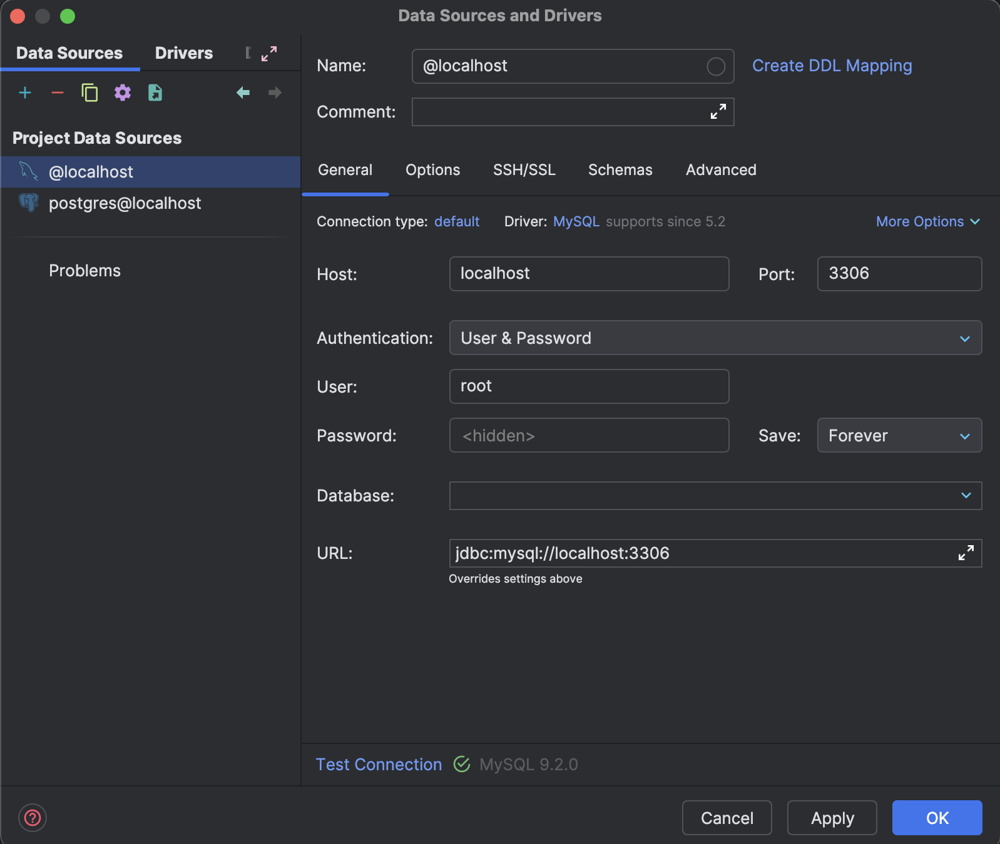
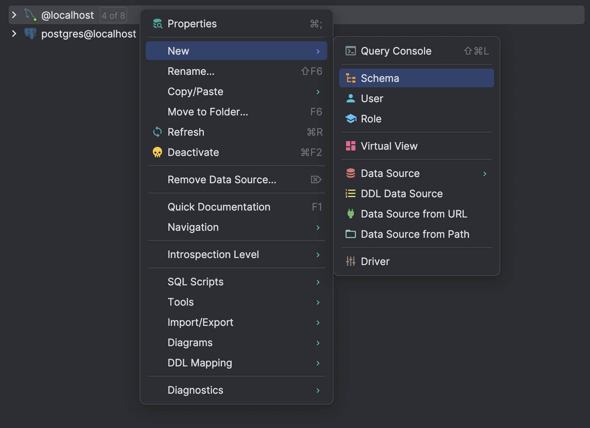
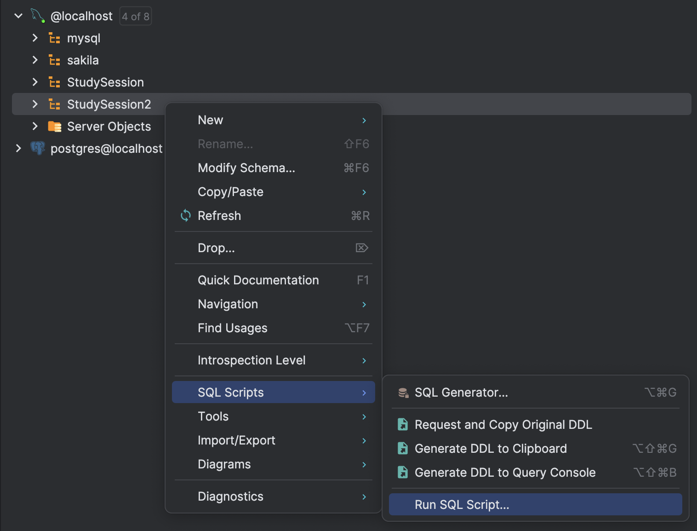

# Getting Started

This project is a final project for a Database Management course. You'll use [DataGrip](https://www.jetbrains.com/datagrip/) to manage your MySQL database locally.

Follow these steps to get your development environment up and running:

## 1. Install pnpm

This project uses [pnpm](https://pnpm.io/) as the package manager. If you don't have it installed, run:

```sh
npm install -g pnpm
```

## 2. Install Dependencies

Run this in the project root:

```sh
pnpm install
```

## 3. Set Up the Database with DataGrip

1. **Open DataGrip and create a new MySQL data source**

   - Use username `root` and an empty password (unless your local MySQL is configured differently).
   - Reference the screenshot below for the correct settings:

   

2. **Create a new schema named `StudySession`**

   - Right-click your MySQL data source and select `New` > `Schema`.
   - See the screenshot below for how to access the "New Schema" option:

   

3. **Run the SQL script to set up tables and sample data**

   - Right-click the `StudySession` schema, go to `SQL Scripts` > `Run SQL Script...`.
   - Select the `dump.sql` file and execute it.
   - See the screenshot below for how to access the "Run SQL Script" option:

   

## 4. Configure Environment Variables

Create a `.env` file in the project root with the env var in the group chat

```env
SESSION_SECRET=super_secret_key
```

## 5. Run the Development Server

```sh
pnpm dev
```

Visit [http://localhost:3000](http://localhost:3000) to view the app.
